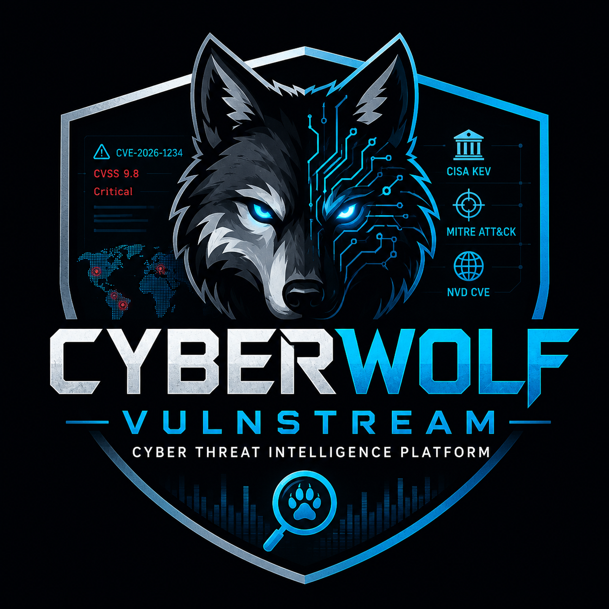
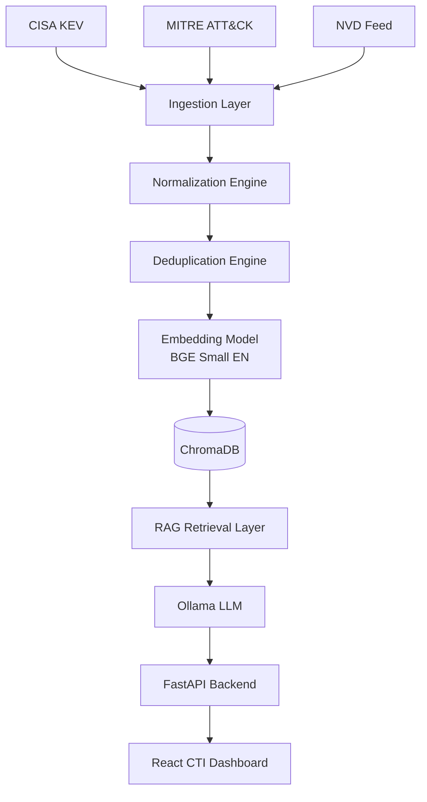

# 🛡️ CyberWolf VulnStream

### Privacy-First Cyber Threat Intelligence Platform Powered by Traditional RAG




---

## 📖 Overview

CyberWolf VulnStream is a cybersecurity-focused Retrieval-Augmented Generation (RAG) platform designed to centralize threat intelligence from multiple trusted sources into a unified knowledge system.

Security analysts often need to switch between:

* National Vulnerability Database (NVD)
* CISA Known Exploited Vulnerabilities (KEV)
* MITRE ATT&CK Framework
* Vendor Security Advisories

CyberWolf VulnStream eliminates this fragmented workflow by ingesting, normalizing, embedding, and retrieving threat intelligence from multiple sources through a single AI-powered interface.

All processing occurs locally, ensuring complete privacy and data ownership.

---

## 🎯 Problem Statement

Threat intelligence is distributed across multiple platforms.

An analyst investigating a vulnerability often needs to:

1. Find the CVE details in NVD.
2. Check whether it is actively exploited in CISA KEV.
3. Understand attacker behavior through MITRE ATT&CK.
4. Review vendor remediation guidance.

This process is slow and inefficient.

CyberWolf VulnStream solves this challenge by providing a unified threat intelligence retrieval platform powered by local Large Language Models and vector search.

---

## ✨ Core Features

### 🔒 Privacy First

* Fully offline deployment
* Local vector database
* Local embeddings
* Local LLM inference via Ollama
* No cloud API dependency

### 🌐 Multi-Source Threat Intelligence

Supported Sources:

* NVD CVE Feed
* CISA Known Exploited Vulnerabilities
* MITRE ATT&CK
* Vendor Advisories (Future)
* Threat Research Blogs (Future)

### 🧠 Hybrid Retrieval

Combines:

* Semantic Search
* Metadata Filtering
* Source-Aware Retrieval

Example:

> Show Critical Apache vulnerabilities actively exploited in the wild.

Filters:

* Vendor = Apache
* Severity = Critical
* Exploited = True

### ⚡ Automated Delta Updates

Background scheduler:

* Runs every 24 hours
* Fetches latest intelligence feeds
* Prevents duplicate embeddings
* Maintains fresh vector indexes

### 📊 Analyst Dashboard

* Threat Search
* CVE Investigation
* ATT&CK Technique Lookup
* Source Citations
* Threat Summaries

---

## 🏗️ System Architecture

### 🏗️ System Architecture



---

## 🧩 Technology Stack

### Frontend

* React
* TailwindCSS
* Axios

### Backend

* FastAPI
* APScheduler
* LangChain

### AI Stack

* Ollama
* DeepSeek-R1
* Llama 3
* BGE-Small-EN Embeddings

### Data Layer

* ChromaDB
* Local File Storage

---

## 📂 Project Structure

```bash
cyberwolf-vulnstream/

├── api/
├── ingestion/
│   ├── cve_loader.py
│   ├── cisa_loader.py
│   ├── mitre_loader.py
│   └── normalizer.py
│
├── retrieval/
├── rag/
├── scheduler/
├── vectordb/
├── frontend/
├── tests/
└── docs/
```

---

## 🚀 Installation

### Clone Repository

```bash
git clone https://github.com/pugazh342/CyberWolf-VulnStream.git

cd cyberwolf-vulnstream
```

### Create Virtual Environment

```bash
python -m venv venv

# Linux
source venv/bin/activate

# Windows

venv\Scripts\activate
```

### Install Dependencies

```bash
pip install -r requirements.txt
```

### Install Ollama

Download and install Ollama.

Pull a local model:

```bash
ollama pull deepseek-r1:8b
```

---

## 🔄 Initial Data Ingestion

```bash
python ingest_manager.py
```

This process:

* Downloads threat feeds
* Normalizes documents
* Generates embeddings
* Stores vectors in ChromaDB

---

## ▶️ Running the Backend

```bash
uvicorn api.main:app --reload
```

Backend URL:

```text
http://127.0.0.1:8000
```

---

## 💻 Running the Frontend

```bash
cd frontend

npm install

npm run dev
```

Frontend URL:

```text
http://127.0.0.1:3000
```

---

## 🔍 Example Queries

### Vulnerability Investigation

```text
What is CVE-2026-1234?
```

### Exploitation Status

```text
Is CVE-2026-1234 actively exploited?
```

### ATT&CK Lookup

```text
Explain ATT&CK Technique T1059.
```

### Threat Hunting

```text
Show critical Apache vulnerabilities exploited in the wild.
```

---

## 🛣️ Roadmap

### Version 1

* Traditional RAG
* NVD Integration
* CISA KEV Integration
* MITRE ATT&CK Integration

### Version 2

* Agentic RAG
* Autonomous Threat Investigation
* IOC Enrichment

### Version 3

* Graph RAG
* Threat Relationship Mapping
* Attack Path Analysis
* Threat Actor Intelligence Graph

---

## 👨‍💻 Author
 
K. Pugazhmani

Cybersecurity Student | Security Engineering Enthusiast | AI Engineer 

---

## 📜 License

MIT License

---

⭐ If you found this project useful, consider starring the repository.
